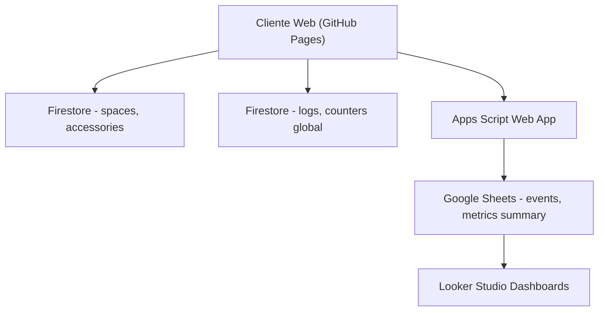

# 🌍 Mapa Colaborativo de Espacios Accesibles
### Aplicación web para registrar y consultar espacios públicos accesibles

Proyecto académico desarrollado en el curso **Proyecto Integrador de la Metodología DevOps** en la Universidad Tecmilenio.  
El objetivo es construir una aplicación web colaborativa que permita registrar y consultar espacios públicos con características de accesibilidad, integrando prácticas de **DevOps**, **monitoreo** y **seguridad**.

---

## ✨ Descripción

El sistema permite:
- Registrar espacios accesibles (parques, plazas, bibliotecas, etc.).
- Visualizar espacios en un mapa interactivo con Leaflet.
- Filtrar por categoría y características (rampa, baño adaptado, señalización, estacionamiento).
- Consultar estadísticas dinámicas.
- Gestionar accesorios asociados a cada espacio.
- Visualizar detalles con imágenes y lista de accesorios.

Se integraron prácticas de **telemetría**, **monitoreo de métricas** y **DevSecOps** para garantizar calidad, seguridad y trazabilidad.

---

## 🛠️ Tecnologías utilizadas

- **Frontend:** HTML, CSS, JavaScript (ES Modules)  
- **Mapas:** [Leaflet.js](https://leafletjs.com/)  
- **Backend / BD:** Firebase Firestore  
- **Autenticación:** Firebase Auth (anónima y con proveedores)  
- **CI/CD:** GitHub Actions + GitHub Pages  
- **Monitoreo:** Google Apps Script + Google Sheets + Looker Studio  
- **Pruebas:** Jest (unitarias)  
- **Seguridad:** Firestore Rules con RBAC, npm audit, Snyk, SonarCloud  

---

## 📐 Arquitectura

---

## 🚀 Funcionalidades principales

- Mapa interactivo con marcadores y panel de detalle  
- Registro de espacios con validación de datos  
- Filtros y búsqueda avanzada  
- Gestión de accesorios (agregar, eliminar, modificar cantidades)  
- Estadísticas dinámicas  
- Telemetría y métricas con alertas configurables  
- Pruebas automatizadas con Jest  
- Seguridad con roles y protección de datos sensibles  

---

## 📊 Monitoreo y retroalimentación

- **Logs:** colección `logs` en Firestore + hoja `events` en Google Sheets  
- **Métricas:** hoja `metrics_summary` con agregaciones por minuto  
- **Visualización:** panel en Looker Studio  
- **Alertas:** notificaciones por correo o webhook  

---

## 🔒 DevSecOps

- Análisis de vulnerabilidades con npm audit, Snyk y SonarCloud  
- Autenticación y control de acceso con Firebase Auth + Firestore Rules  
- Protección de datos sensibles con cifrado en cliente y gestión de secretos  

---

## 📈 Próximos pasos

- Migrar métricas a BigQuery + Cloud Monitoring  
- Integrar paneles en Grafana o Datadog  
- Extender autenticación con más proveedores  
- Mejorar diseño accesible y responsivo  
- Documentar casos de uso y publicar guías de contribución  

---

## 👨‍💻 Autor

**Fernando Gorostieta Vargas**  
Proyecto académico — Universidad Tecmilenio, Cancún, México  

---

## 📄 Licencia

MIT
